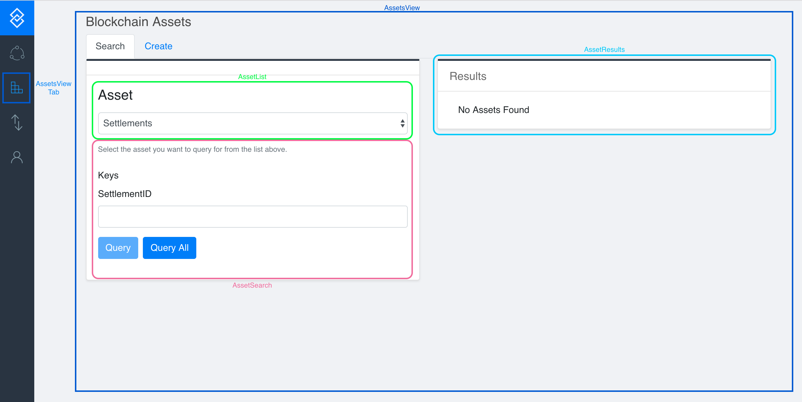
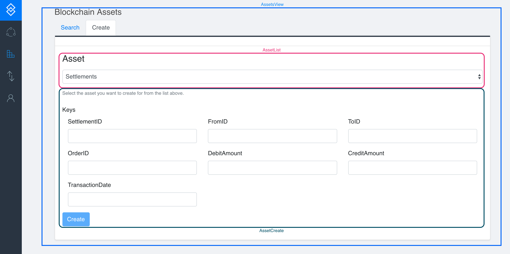

## What is this?

This is the UI for Project Kickstarter. It's written in ReactJS.

## Sending Feedback

If you have any questions, concerns, etc, give the author a shout: james.crowson@chainyard.com <br>
You may also give the following developers a whisper: sindhu.asara@itpeoplecorp.com, anthony.kan@chainyard.com

## Folder Structure

After creation, your project should look like this:

```
my-app/
  README.md
  node_modules/
  package.json
  public/
    index.html
    favicon.ico
  src/
    App.css
    App.js
    App.test.js
    index.css
    index.js
    logo.svg
```

## To Start

In the project directory, you can run:

### `npm start`

Runs the app in the development mode.<br>
Open [http://localhost:3000](http://localhost:3000) to view it in the browser.

The page will reload if you make edits.<br>
You will also see any lint errors in the console.

### `npm test`

Launches the test runner in the interactive watch mode.<br>
See the section about [running tests](#running-tests) for more information.

### `npm run build`

Builds the app for production to the `build` folder.<br>
It correctly bundles React in production mode and optimizes the build for the best performance.

The build is minified and the filenames include the hashes.<br>
Your app is ready to be deployed!

See the section about [deployment](#deployment) for more information.

### Assets Structure
```
Asset
| AssetCreate
| AssetCreate.test
| AssetList
| AssetList.test
| AssetResults
| AssetResults.test
| AssetSearch
| AssetSearch.test
| AssetsView
| AssetsView.test
```

### Explanation of Assets
AssetsView is the logical **parent** of all of the other components.
Each component is coupled with a .test js file, `npm test` will pick up on these files and test them.

1. AssetList is the dropdown picker which ultimately sets the activeObject which is printed out as <Fields> by AssetSearch and Create.
2. AssetSearch is the default view and component which works in conjunction with AssetResults which prints out the list of <Assets>
3. AssetCreate is the alternate view and component which prints out the keys of the activeObject as <Fields>.

### Visual Explanation of Assets
<br>

